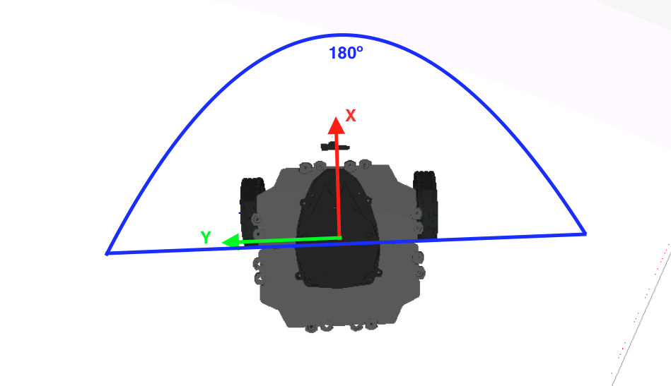
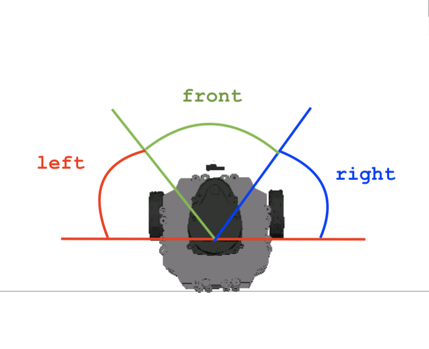
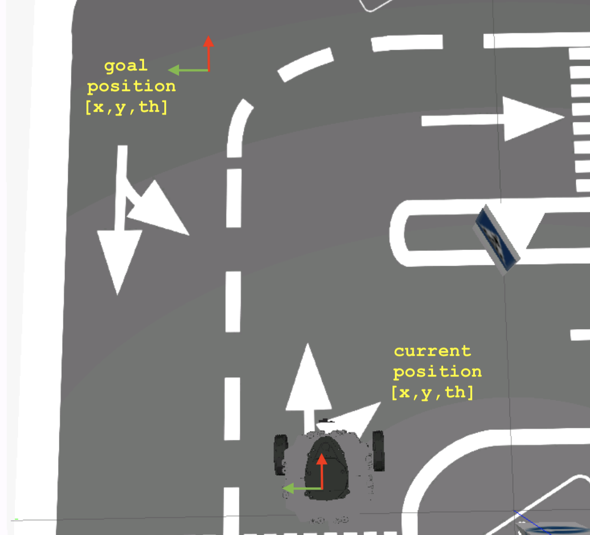

# Checkpoints 5 & 6 - Introduction to ROS 2

Autonomous patrol and navigation system for a TurtleBot3 robot built with **C++** and **ROS 2 (Humble)**. The robot navigates a city lab environment using laser scan data, a direction service for obstacle avoidance, and an action server for goal-based navigation. Tested in both simulation (Gazebo) and on a real TurtleBot3 in Barcelona, Spain.

Part of the [ROS & ROS 2 Developer Master Class](https://www.theconstructsim.com/) certification (Phase 1).

<p align="center">
  
</p>

## Checkpoint 5 - Topics (Patrol Node)

A reactive obstacle avoidance node that drives the robot through the environment using laser scan data.

<p align="center">
  
</p>

### Algorithm

1. Reads laser distances at -15°, 0°, and 15° to detect frontal obstacles
2. If clear (distance > threshold): drives straight
3. If blocked: scans -90° to 90°, finds the direction with maximum distance, steers toward it
4. Linear velocity is halved while turning

### Parameters

| Parameter | Default | Description |
|---|---|---|
| `obstacle_threshold` | 0.35 m | Distance to trigger avoidance |
| `linear_velocity` | 0.1 m/s | Forward speed |
| `angular_gain` | 0.5 | Angular velocity multiplier |

---

## Checkpoint 6 - Services & Actions

### Task 1: Direction Service

A ROS 2 service that replaces the inline obstacle avoidance logic with a dedicated service server, making the architecture more modular.

<p align="center">
  
</p>

**How it works:**
1. The service receives the full laser scan data from the caller
2. Divides the front 180° into three 60° sections: left (-90° to -30°), front (-30° to 30°), right (30° to 90°)
3. Sums the distances in each section
4. If front is clear (> 0.35 m): returns `"forward"`
5. If blocked: returns `"left"` or `"right"` based on which section has the largest total distance

**Custom interface** - `GetDirection.srv`:
```
sensor_msgs/LaserScan laser_data
---
string direction
```

**`patrol_with_service.cpp`** replaces the original patrol node, calling `/direction_service` on every laser callback and applying:
- `"forward"` → linear: 0.1, angular: 0.0
- `"left"` → linear: 0.1, angular: 0.5
- `"right"` → linear: 0.1, angular: -0.5

### Task 2: Go-To-Pose Action

An action server that sends the robot to a specific position (x, y, theta) using odometry feedback.

<p align="center">
  
</p>

**Control loop:**
1. Subscribes to `/odom`, converts quaternion to yaw for current pose
2. Computes distance and angle error to the goal
3. Drives at 0.2 m/s with proportional angular correction (gain = 1.5)
4. Once within 5 cm of the goal position, performs final orientation adjustment
5. Returns `status: true` when both position and orientation are reached

**Custom interface** - `GoToPose.action`:
```
# Goal
geometry_msgs/Pose2D goal_pos
---
# Result
bool status
---
# Feedback
geometry_msgs/Pose2D current_pos
```

## ROS 2 Interfaces

### Topics

| Name | Type | Node | Direction |
|---|---|---|---|
| `/scan` | `sensor_msgs/LaserScan` | patrol / patrol_with_service | Subscription |
| `/cmd_vel` | `geometry_msgs/Twist` | patrol / patrol_with_service / go_to_pose | Publisher |
| `/odom` | `nav_msgs/Odometry` | go_to_pose | Subscription |

### Services

| Name | Type | Description |
|---|---|---|
| `/direction_service` | `robot_patrol/GetDirection` | Analyzes laser data, returns safest direction |

### Actions

| Name | Type | Description |
|---|---|---|
| `/go_to_pose` | `robot_patrol/GoToPose` | Navigates robot to a goal pose (x, y, theta) |

## Project Structure

```
citylab_project/
└── robot_patrol/
    ├── CMakeLists.txt
    ├── package.xml
    ├── action/
    │   └── GoToPose.action
    ├── srv/
    │   └── GetDirection.srv
    ├── config/
    │   └── robot_patrol_config.rviz
    ├── launch/
    │   ├── start_patrolling.launch.py          # CP5: patrol + RViz2
    │   ├── start_direction_service.launch.py   # CP6: direction service server
    │   ├── start_test_service.launch.py        # CP6: service tester
    │   ├── main.launch.py                      # CP6: service + patrol combined
    │   └── start_gotopose_action.launch.py     # CP6: go-to-pose action server
    ├── include/
    │   └── robot_patrol/
    └── src/
        ├── patrol.cpp                  # CP5: reactive obstacle avoidance
        ├── direction_service.cpp       # CP6: direction service server
        ├── patrol_with_service.cpp     # CP6: patrol using service client
        ├── test_service.cpp            # CP6: service tester node
        └── go_to_pose_action.cpp       # CP6: action server for goal navigation
```

## How to Use

### Prerequisites

- ROS 2 Humble
- Gazebo (city lab simulation from `simulation_ws`)
- TurtleBot3 packages

### Build

```bash
cd ~/ros2_ws
colcon build --packages-select robot_patrol
source install/setup.bash
```

### Launch the Simulation

```bash
source ~/simulation_ws/install/setup.bash
ros2 launch turtlebot3_gazebo main_turtlebot3_lab.launch.xml
# Unpause physics in Gazebo
```

### Checkpoint 5: Simple Patrol

```bash
ros2 launch robot_patrol start_patrolling.launch.py
```

### Checkpoint 6: Service-Based Patrol

```bash
ros2 launch robot_patrol main.launch.py
```

### Checkpoint 6: Go-To-Pose Action

```bash
# Terminal 1 - Launch action server
ros2 launch robot_patrol start_gotopose_action.launch.py

# Terminal 2 - Send a goal
ros2 action send_goal -f /go_to_pose robot_patrol/action/GoToPose "goal_pos:
  x: 0.7
  y: 0.3
  theta: 0.0
"
```

### Test the Direction Service Independently

```bash
# Terminal 1
ros2 launch robot_patrol start_direction_service.launch.py

# Terminal 2
ros2 launch robot_patrol start_test_service.launch.py
```

## Key Concepts Covered

- **ROS 2 Topics** (CP5): publishers, subscribers, timer-based control loops
- **ROS 2 Services** (CP6): custom `.srv` interfaces, service servers/clients, async requests
- **ROS 2 Actions** (CP6): custom `.action` interfaces, action servers, goal/feedback/result handling
- **Laser scan processing**: angle-to-index conversion, section-based distance aggregation
- **Odometry processing**: quaternion to yaw conversion without tf2
- **Proportional control**: angle-error-based steering for goal navigation
- **Multi-threaded executor**: handling concurrent service calls in patrol_with_service
- **Real robot testing**: deploying on a physical TurtleBot3 via remote lab

## Technologies

- ROS 2 Humble
- C++ 17
- Gazebo (city lab simulation)
- RViz2
- TurtleBot3 (simulation + real robot)
