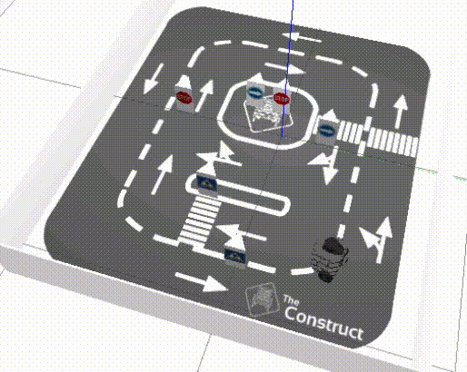

# Checkpoint 5 - Introduction to ROS 2 Part 1

Autonomous patrol node for a mobile robot built with **C++** and **ROS 2 (Humble)**. The robot navigates a city lab environment using laser scan data to detect and avoid obstacles in real time, continuously patrolling without human intervention.

Part of the [ROS & ROS 2 Developer Master Class](https://www.theconstructsim.com/) certification (Phase 1).

<p align="center">
  
</p>

## How It Works

The `Patrol` node implements a reactive obstacle avoidance algorithm using the front-facing 180° laser scan:

<p align="center">
  
</p>

### Algorithm

1. **Frontal check**: reads laser distances at -15°, 0°, and 15° to detect obstacles ahead
2. **If clear** (distance > threshold): drives straight at the configured linear velocity
3. **If blocked** (distance <= threshold): scans the full -90° to 90° range, finds the direction with maximum distance, and steers toward it
4. **While turning**: linear velocity is reduced by 50% and angular velocity is proportional to the target direction angle

The direction is clamped to [-pi/2, pi/2] and the control loop runs at 10 Hz.

### Parameters

| Parameter | Default | Description |
|---|---|---|
| `obstacle_threshold` | 0.35 m | Distance to trigger obstacle avoidance |
| `linear_velocity` | 0.1 m/s | Forward speed |
| `angular_gain` | 0.5 | Multiplier for angular velocity when turning |

All parameters are declared as ROS 2 parameters and can be changed at runtime.

## ROS 2 Interface

| Name | Type | Direction | Description |
|---|---|---|---|
| `/scan` | `sensor_msgs/LaserScan` | Subscription | Laser scan data for obstacle detection |
| `/cmd_vel` | `geometry_msgs/Twist` | Publisher | Velocity commands to the robot |

## Project Structure

```
citylab_project/
└── robot_patrol/
    ├── CMakeLists.txt
    ├── package.xml
    ├── config/
    │   └── robot_patrol_config.rviz
    ├── launch/
    │   └── start_patrolling.launch.py    # Launches patrol + RViz2
    ├── include/
    │   └── robot_patrol/
    └── src/
        └── patrol.cpp                    # Patrol node implementation
```

## How to Use

### Prerequisites

- ROS 2 Humble
- Gazebo (city lab simulation from `simulation_ws`)

### Build

```bash
cd ~/ros2_ws
colcon build --packages-select robot_patrol
source install/setup.bash
```

### Launch the Simulation

```bash
# In a sourced ROS 1 + ROS 2 bridge environment (if needed)
roslaunch simulation_ws citylab_gazebo.launch
```

### Start Patrolling

```bash
ros2 launch robot_patrol start_patrolling.launch.py
```

The robot will begin navigating autonomously, avoiding obstacles as it encounters them. RViz2 opens alongside to visualize the laser scan and robot movement.

### Change Parameters at Runtime

```bash
# Increase speed
ros2 param set /patrol_node linear_velocity 0.2

# Adjust obstacle threshold
ros2 param set /patrol_node obstacle_threshold 0.5
```

## Key Concepts Covered

- **ROS 2 node architecture**: `rclcpp::Node` with publishers, subscribers, and timers
- **Laser scan processing**: converting angles to indices, scanning for max distance
- **Reactive obstacle avoidance**: real-time decision-making based on sensor data
- **ROS 2 parameters**: declaring and reading dynamic parameters at runtime
- **ROS 2 launch files**: Python-based launch with `LaunchDescription`
- **ament_cmake build system**: `CMakeLists.txt` with `ament_target_dependencies`

## Technologies

- ROS 2 Humble
- C++ 17
- Gazebo (city lab simulation)
- RViz2
